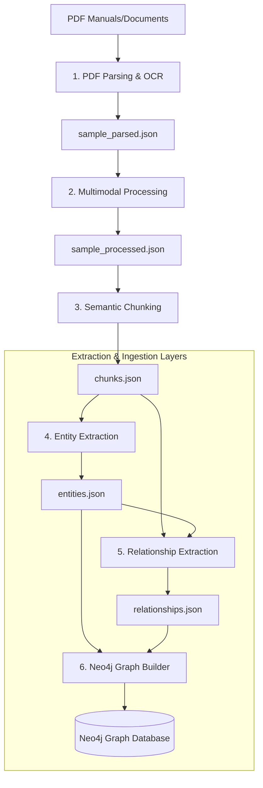

# Dell FutureMinds — GraphRAG Pipeline

A modular, end-to-end GraphRAG (Retrieval-Augmented Generation) pipeline that parses PDF documentation (including text, tables, and images), applies semantic chunking, extracts entities and relationships using LLMs, and indexes the resulting property graph in Neo4j.

---

## Pipeline Workflow



---

## Project Structure

- **`parser/`**: Extract text, layout sections, tables, and raw images from PDFs.
- **`processor/`**: Process images and generate descriptions/captions for multimodal content.
- **`chunker/`**: Segment text, tables, and images semantically using embedding similarity boundaries.
- **`extractor/`**: LLM structured entity extraction (Organizations, People, Products, etc.).
- **`relationship/`**: LLM relationship extraction connecting entities contextually.
- **`graph_builder/`**: Constructs the property graph in Neo4j (batch ingestion, constraints, health checks).
- **`output/`**: Directory for intermediate artifacts (`sample_parsed.json`, `sample_processed.json`, `chunks.json`, etc.).

---

## Setup Instructions

### 1. Prerequisites
- **Python**: Version `3.10` or higher.
- **Package Manager**: [uv](https://github.com/astral-sh/uv) (recommended for speed and reliability).
- **Graph Database**: A running Neo4j database instance.

### 2. Install Dependencies
Set up the virtual environment and sync dependencies:
```bash
# Sync/install via uv
uv sync
```
If you do not have `uv` installed, use standard virtualenv and pip:
```bash
python -m venv .venv
.venv\Scripts\activate
pip install -r pyproject.toml
```

### 3. Environment Configuration
Create a `.env` file in the root directory:
```ini
MISTRAL_API_KEY="your_mistral_api_key_here"

# Neo4j Database Connection
NEO4J_URI=neo4j+s://your_neo4j_aura_uri
NEO4J_USER=neo4j
NEO4J_PASSWORD=your_neo4j_password_here

# Optional: Set if using a specific database name on a multi-database Neo4j instance
# NEO4J_DATABASE=neo4j
```

---

## Executing the Pipeline

The full end-to-end GraphRAG pipeline is orchestrated via the unified entry point [main.py](file:///c:/Codes/Dell-Inspiron/main.py).

### Run Document Ingestion & Knowledge Construction
To run the ingestion pipeline (Parsing, Multimodal Processing, Semantic Chunking, Entity Extraction, Relationship Extraction, Neo4j Graph Construction, and local FAISS vector store generation):
```bash
uv run python main.py --ingest
```

#### Ingestion Custom Options:
- `--pdf <path>`: Specify a custom PDF file to ingest (default: `data/pdfs/sample.pdf`).
- `--force`: Bypass checkpoints and force re-running of all ingestion stages (by default, already completed stages with matching output artifacts are skipped).

#### Ingestion Checkpoints:
The ingestion pipeline uses checkpoints to avoid repeating expensive, time-consuming stages. It checks for:
1. `output/chunks.json` to skip PDF parsing, multimodal processing, and semantic chunking.
2. `output/entities.json` to skip entity extraction.
3. `output/relationships.json` to skip relationship extraction.
4. `output/.graph_ingested` flag file to skip Neo4j graph building.
5. `output/.pinecone_ingested` flag file to skip FAISS embedding storage.

---

## Property Graph Schema

### Nodes
- **`(:Entity)`**:
  - `entity_id` (Unique Identifier)
  - `entity_name` (e.g., "Mistral Large")
  - `entity_type` (e.g., "TECHNOLOGY")
- **`(:Chunk)`**:
  - `chunk_id` (Unique Identifier)
  - `page_number` (Original PDF page number)

### Relationships
- **`(:Entity)-[:APPEARS_IN {confidence}]->(:Chunk)`**: Provenance mapping.
- **`(:Entity)-[:<TYPE> {relationship_id, confidence, chunk_id, page_number}]->(:Entity)`**: Typed links between entities. Available types include: `USES`, `DEPENDS_ON`, `CONTRIBUTES_TO`, `LOCATED_IN`, `RELATED_TO`, and custom domain relations.

---

## Retrieval Layer (7-Agent Workflow)

The retrieval pipeline consists of 7 modular agents orchestrated sequentially to perform hybrid GraphRAG context retrieval:

1. **Query Planner Agent**: Analyzes the query intent, extracts query entities, and plans which retrieval strategies are needed (semantic, graph, or both).
2. **Semantic Retrieval Agent**: Performs fast similarity search against the document chunks cached in the local vector database (FAISS/Pinecone).
3. **Graph Retrieval Agent**: Performs bounded traversal (depth 1 or 2) in Neo4j from query entities, prioritizing relationships by confidence and node importance.
4. **Fusion Agent**: Fuses and deduplicates semantic and graph results using a weighted hybrid score.
5. **Re-ranking Agent**: Employs a cross-encoder model to re-score and sort the fused chunk list.
6. **Evidence Agent**: Compiles source chunks, neighbor chunks (context expansion), source entities, and graph paths.
7. **Context Builder Agent**: Deduplicates evidence, formats the final answer context within the token budget, and packages the results.

### Running Query & Answer Generation

The query pipeline executes Query Planning, Semantic Retrieval, Graph Retrieval, Fusion, Re-ranking, Context Building, and Answer Synthesis to produce a final attributed answer.

#### 1. Single-Query Mode
To run context retrieval and answer synthesis for a specific question:
```bash
uv run python main.py --query "What is the battery warranty?"
```

#### 2. Interactive REPL Mode
To run an interactive query session:
```bash
uv run python main.py --interactive
```

#### Custom Options
- `--top-k <int>`: Number of results to keep after cross-encoder re-ranking (default: `15`).
- `--token-budget <int>`: Token budget limit for the final context (default: `4000`).

### Structured Output Format
The pipeline produces a structured JSON output package ready for answer generation:
```json
{
  "answer_context": "Formatted context string containing chunks...",
  "evidence_chunks": [
    {
      "chunk_id": "chunk_215",
      "content": "...",
      "page_number": 64,
      "section_name": "Warranty",
      "source_document": "sample.pdf",
      "score": 2.518,
      "source": "BOTH",
      "is_neighbor": false
    }
  ],
  "graph_paths": [
    {
      "source": "Battery",
      "relationship": "RELATED_TO",
      "target": "Warranty",
      "confidence": 0.85
    }
  ],
  "source_entities": [
    {
      "entity_id": "ent_123",
      "entity_name": "Battery",
      "entity_type": "TECHNOLOGY",
      "relationship_role": "matched"
    }
  ],
  "retrieval_metadata": {
    "query": "...",
    "intent": "FACTUAL",
    "planner_plan": {
      "semantic_needed": true,
      "graph_needed": true,
      "both_needed": true,
      "traversal_depth": 1
    },
    "candidates_count": 35,
    "stage_timings": [...],
    "total_duration_ms": 1234.5
  }
}
```

---

## Answer Synthesis Layer (Stage 8)

The Answer Synthesis Layer is a dedicated **Stage 8** that sits on top of the 7-agent retrieval pipeline. It consumes the Top 3 re-ranked results and generates a grounded, attributed, confidence-scored answer.

### 6-Step Synthesis Workflow

1. **Evidence Selection**: Selects the Top 3 highest-ranked primary evidence chunks from the retrieval result.
2. **Evidence Consolidation**: Deduplicates overlapping text, identifies common vs. complementary facts, and merges graph relationships into a unified context.
3. **Answer Generation**: Invokes the LLM (Mistral) with a synthesis-focused prompt that enforces grounding, no-hallucination, and conflict resolution by relevance score.
4. **Evidence Attribution**: Extracts `page_number`, `chunk_id`, and `source_document` from each evidence chunk.
5. **Reasoning Path**: Builds human-readable `Entity → Relationship → Entity` chains from graph traversal data.
6. **Confidence Calculation**: Computes a weighted composite score from retrieval relevance (50%), relationship confidence (25%), and evidence agreement (25%).

### Executing Synthesis via main.py

The Answer Synthesis layer is now fully integrated into the unified query execution mode of `main.py`. Standard queries automatically invoke both Stage 1-7 (Retrieval) and Stage 8 (Answer Synthesis).

### Synthesis Output Format
```json
{
  "answer": "The battery warranty covers defects in materials and workmanship for one year from the date of purchase.",
  "evidence": [
    {
      "page_number": 64,
      "chunk_id": "chunk_215",
      "source_document": "sample.pdf"
    }
  ],
  "reasoning_path": [
    "Battery → RELATED_TO → Warranty",
    "Warranty → APPEARS_IN → Page 64"
  ],
  "confidence": "High"
}
```

### Confidence Scoring

| Level | Composite Score | Meaning |
|---|---|---|
| **High** | ≥ 0.70 | Strong evidence agreement, high relevance, graph support |
| **Medium** | 0.40 – 0.69 | Moderate evidence with some gaps |
| **Low** | < 0.40 | Weak or conflicting evidence |

## API Layer

A FastAPI wrapper sits on top of the existing CLI pipeline (`main.py`), exposing it over HTTP.

### Running the API
```bash
uv add fastapi uvicorn pydantic
uv run uvicorn api.server:app --reload --port 8000
```

### Endpoints

- `GET /health` — liveness check
- `POST /query` — runs retrieval + answer synthesis for a question
```json
  { "query": "What is the battery warranty?" }
```
  Responses are cached in-memory per server session — repeated identical
  queries return near-instantly instead of re-running the full pipeline
  (~15-30s cold).

- `POST /ingest` — accepts a PDF upload (`multipart/form-data`, field `file`)
  and an optional `force` flag, then runs ingestion in the background.

  ⚠️ **Known limitation:** ingestion checkpoints (`output/chunks.json` etc.)
  are keyed by file existence, not document identity. Uploading a new PDF
  is silently skipped unless `force=true` is set — and forcing it
  overwrites/mixes with the existing knowledge base, since there's no
  per-document separation yet. Needs a fix on the pipeline side for real
  multi-PDF support.

### Project structure (API)
```
api/
├── server.py        # FastAPI app, CORS, router mounting
├── models/           # pydantic request/response schemas, one file per endpoint
└── routes/           # endpoint logic, one file per endpoint
```